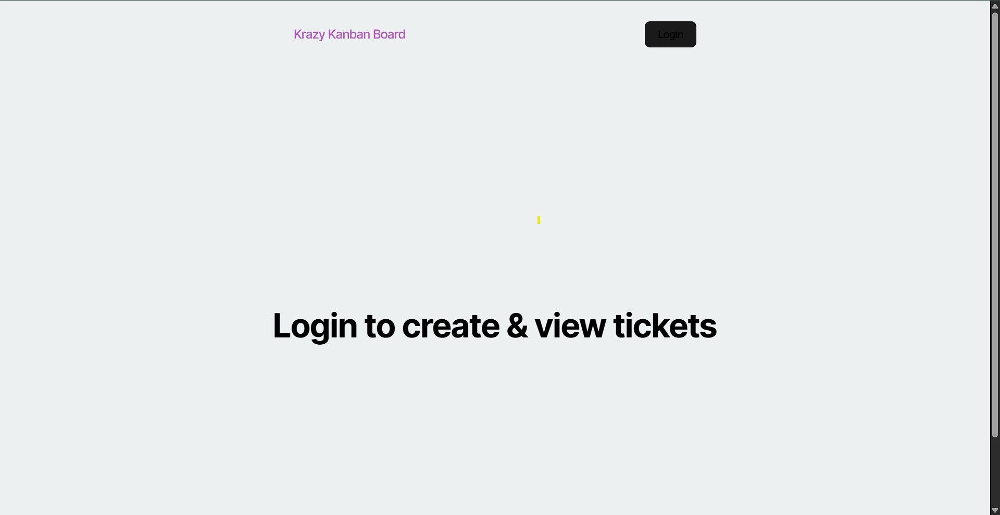

# 📌 Kanban Board with JWT Authentication


This project is a full-stack Kanban board application enhanced with secure user authentication using JSON Web Tokens (JWT). It allows users to securely log in, manage tasks across different columns, and automatically handles session management through token expiration.

---

## 📂 Table of Contents
- [Description](#description)
- [Features](#features)
- [Getting Started](#getting-started)
- [Technologies Used](#technologies-used)
- [Environment Variables](#environment-variables)
- [Usage](#usage)
- [Deployment](#deployment)
- [Author](#author)

---

## 📖 Description

This Kanban board application is designed for agile teams to manage tasks efficiently. Users must log in securely using their credentials, which are verified on the backend and returned as a JWT. Authenticated users can access their board and manage tasks. The token is stored in the client’s local storage and used for protected route access.

---

## ✅ Features

- JWT-based login and authentication
- Protected API routes
- Auto-expiring sessions
- Secure logout and redirection
- Column-based task management (To Do, In Progress, Done)
- Responsive UI

---

## 🚀 Getting Started

1. **Clone the repo**
   ```bash
   git clone https://github.com/OutsideofemiT/Kanban_14.git
   cd Kanban_14
   ```

2. **Install dependencies**
   ```bash
   cd server && npm install
   cd ../client && npm install
   ```

3. **Create a `.env` file in `server/`**
   ```env
   DB_URL=your_postgres_database_url
   JWT_SECRET=your_jwt_secret_key
   PORT=3001
   ```

4. **Run locally**
   ```bash
   # From root directory
   npm run dev
   ```

---

## 🛠 Technologies Used

- **Frontend:** React, Vite, TypeScript
- **Backend:** Node.js, Express, Sequelize, PostgreSQL
- **Authentication:** JSON Web Tokens (JWT)
- **Deployment:** Render

---

## 🔐 Environment Variables

| Variable      | Description                     |
|---------------|---------------------------------|
| `DB_URL`      | PostgreSQL connection string    |
| `JWT_SECRET`  | Secret key for signing JWTs     |
| `PORT`        | Port for server (default: 3001) |

---

## 🧪 Usage

- Visit the login page and authenticate with valid credentials.
- Manage your tasks by creating, updating, and deleting tickets.
- Log out to destroy your session.
- Inactivity for over 2 hours will auto-expire your token.

---

## 🌐 Deployment

This app is deployed on Render:  
🔗 [https://kanban-14.onrender.com](https://kanban-14.onrender.com)




---

## 👩‍💻 Author

Created by [Carmen Wheeler](https://github.com/OutsideofemiT)  
Credits to the starter code provided by the curriculum team.  
Badges generated with [Shields.io](https://shields.io).

